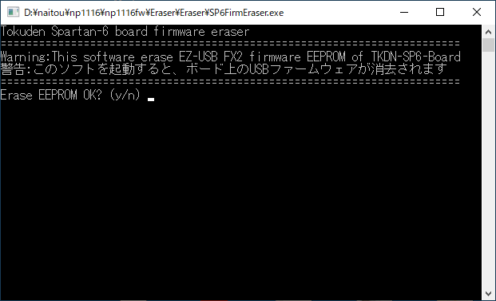

# FX2Writer説明書
2021年1月30日作成  
(C)Copyright 特殊電子回路株式会社

## 概要
このソフトウェアは、特電Spartan-6ボードのファームウェアが書き込まれたEZ-USB FX2のファームウェアROMを消去します。

## 使い方
SP6FirmEraser.exeを実行し、yを押します。

## ライセンス
アプリの利用はもちろん、ソースコードの参照など利用者の責任の範囲で自由に使用して構いません。

